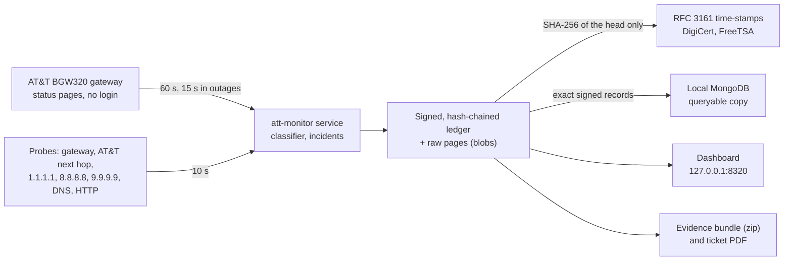

# AT&T BGW320 Evidence Logger (`att-monitor`)

**Tamper-evident, time-stamped evidence of AT&T Fiber outages, so you can show AT&T that a problem
is on *their* side.**

`att-monitor` is a Windows service that watches an AT&T Fiber connection around the clock through the
AT&T **BGW320** gateway (tested with the BGW320-505) and through independent Internet probes. It
classifies every 10-second cycle with conservative, versioned rules and writes everything into an
append-only, hash-chained, Ed25519-signed ledger that public Time-Stamp Authorities time-stamp. A local
dashboard shows what is happening, the ledger is mirrored into a local **MongoDB** for queries, and one
command turns the last 24 hours into a **PDF for an AT&T service ticket**, backed by an evidence bundle
that anyone can verify.

> Not affiliated with or endorsed by AT&T. "AT&T", "BGW320" and the gateway's page names belong to
> their owners. The monitor only reads the gateway's own status pages and changes one gateway setting
> (the outage redirect, see below).

---

## Contents

- [What it records](#what-it-records)
- [How it works](#how-it-works)
- [Requirements](#requirements)
- [Install](#install)
- [The gateway's outage "hijack" redirect](#the-gateways-outage-hijack-redirect)
- [Dashboard](#dashboard)
- [Data storage: ledger and MongoDB](#data-storage-ledger-and-mongodb)
- [Report for an AT&T service ticket](#report-for-an-att-service-ticket)
- [Giving evidence to AT&T](#giving-evidence-to-att)
- [Chain of custody](#chain-of-custody)
- [Commands](#commands)
- [Configuration](#configuration)
- [Privacy, security and network use](#privacy-security-and-network-use)
- [Development](#development)
- [Acknowledgements](#acknowledgements)

## What it records

* **AT&T's own gateway**: every minute (every 15 s during an outage) the BGW320's status pages, which
  need no login: broadband and WAN state, fiber/PON state (`O1 INIT` … `O5 OPERATION`), the optical
  receive and transmit power **with the gateway's own low-Rx ALARM/WARNING flags and thresholds**, the
  fiber "Last Change" counter, uptime (restarts), firmware, serial number and clock. The raw pages are
  stored byte for byte.
* **The path to the Internet**: every 10 s pings and TCP connects to the gateway, AT&T's next hop and
  three independent providers (Cloudflare, Google, Quad9); every minute DNS (gateway, AT&T and public
  resolvers) and HTTP checks; traceroutes during outages.
* **The home side**: Wi-Fi or Ethernet link state and signal, whether traffic actually leaves through
  the AT&T gateway (a VPN or second network is detected), heavy household traffic, PC sleep and resume,
  and the PC clock against NTP servers.
* **A verdict per cycle**: `ONLINE`, `DEGRADED`, `ISP_OUTAGE` or `LOCAL_FAULT`, with a cause (for
  example `FIBER_LINK_DOWN`: the gateway itself reports its fiber link down) and an attribution
  (provider, local, undetermined). Rules are conservative: a gateway restart, a VPN, a Wi-Fi drop, PC
  sleep, heavy traffic or a single lost DNS packet is never blamed on AT&T. An incident opens when 3 of
  the last 6 cycles fail and its downtime is measured cycle by cycle.

## How it works



* Every record is a JSON line `{"h": SHA-256(b), "s": Ed25519(b), "b": "<record>"}`; each record names
  the hash of the one before it, so removing, reordering or editing any record breaks the chain. The
  signing key is created on first start and protected with Windows DPAPI (machine scope).
* Every 30 minutes and after each outage, the SHA-256 of the newest record is sent to two public
  Time-Stamp Authorities. Their signed RFC 3161 tokens prove that the ledger up to that record existed
  at that time.
* The ledger is the source of truth. The MongoDB copy, the dashboard, the exports and the PDF are all
  derived from it.

## Requirements

* Windows 10 or 11 (the service runs as LocalSystem), on a PC connected to the AT&T gateway. A wired
  Ethernet connection makes the evidence stronger.
* An AT&T BGW320 gateway and its **Device Access Code** (printed on the gateway's label). The code is
  needed only to switch the outage redirect off; everything else uses pages that need no login.
* [Go](https://go.dev/dl/) 1.27 or newer to build (the build fetches the right toolchain if needed).
* Optional: [MongoDB Community Server](https://www.mongodb.com/try/download/community) running
  locally (the default `mongodb://127.0.0.1:27017`) for the queryable copy.
* Optional: Microsoft Edge or Google Chrome (to print the ticket PDF), and Python 3.9+ (to run the
  verifier shipped inside every evidence bundle).

## Install

### Quick install (no build tools needed)

1. On the PC that is connected to your AT&T gateway, download **`ATT-Monitor-Setup-<version>.exe`** from
   the [latest release](https://github.com/siujacky/ATT_BW320_evidence_logger/releases/latest).
2. Double-click it. The program is not code-signed, so Windows may say it protected your PC: choose
   **More info → Run anyway**. Then choose **Yes** when Windows asks for administrator permission.
3. Type the **Device Access Code** printed on the label of your AT&T gateway (not the Wi-Fi password).
   What you type is not shown.

Setup checks the code with the gateway (a read-only login), installs and starts the service, shows your
**evidence key** and opens the dashboard. Write the key down or email it to yourself: it identifies your
evidence. If the code is mistyped, setup asks again; the gateway allows one login attempt per minute, so
it waits when needed, and after three rejections it stops trying for an hour, so the gateway's login is
never locked.

Running the same file again updates the program; press Enter at the code prompt to keep the stored
code. The dashboard is also in the Start menu ("AT&T Internet Monitor"). To uninstall, open Settings →
Apps → Installed apps → *AT&T Internet Monitor (evidence logger)* → Uninstall. Your evidence in
`C:\ProgramData\ATTMonitor` is kept.

### Build from source

1. Get the code and build it:

   ```powershell
   git clone https://github.com/siujacky/ATT_BW320_evidence_logger.git
   cd ATT_BW320_evidence_logger
   .\build.ps1              # secret scan, go vet, tests, bin\att-monitor.exe
   ```

2. Create `password.txt` next to `build.ps1` with the gateway's address and Device Access Code. The file
   is in `.gitignore`; the build refuses to continue if the code appears in any source file.

   ```text
   ip:192.168.1.254
   password:<the Device Access Code from the gateway label>
   ```

3. Install the service from an **elevated** PowerShell:

   ```powershell
   .\build.ps1 -Install
   # or: .\bin\att-monitor.exe install --access-code-file .\password.txt
   ```

   This copies the program to `C:\Program Files\ATT Monitor\`, stores the access code DPAPI-encrypted in
   `C:\ProgramData\ATTMonitor\keys\` (you may delete `password.txt` afterwards), creates and starts the
   `ATTMonitor` service and prints the **ledger key fingerprint**. Write the fingerprint down or email it
   to yourself: it identifies your evidence, and you give it to AT&T separately from any evidence.

   If you saved gateway pages before installing (setup-time evidence), pass the folder with
   `--bootstrap DIR`; it is imported into the ledger as the first record after genesis.

You can also double-click `bin\att-monitor.exe`, or run `att-monitor setup`, for the guided setup
described above.

**Upgrade:** build a newer version and run `install` (or `setup`) again, elevated. The service stops,
the program is replaced and the service restarts; the ledger continues. **Uninstall:** Settings → Apps,
or `att-monitor uninstall`. Either way the service, the program, its Start menu shortcut and its
Settings entry are removed, and the evidence in `C:\ProgramData\ATTMonitor` is kept.

## The gateway's outage "hijack" redirect

When the fiber or WAN is down, the BGW320 by default **redirects web browsing to its own "broadband is
down" page** (Diagnostics → Event Notifications → *Broadband Status Notification*). That hijacks the
connection your probes and browser use exactly when you need to see what is happening. The service
switches the redirect **off**, checks it at startup and every day, records every check in the ledger,
and switches it off again if AT&T re-enables it (for example with a firmware update or a remote reset).

```powershell
att-monitor gateway notification status
att-monitor gateway notification on    # restore AT&T's default (also stops the automatic enforcement)
att-monitor gateway notification off   # switch the redirect off again (and resume enforcement)
```

The monitor also records what the gateway's DNS answers during an outage: answers for every name that
point at the gateway itself are recorded as a DNS hijack. AT&T's account-level "DNS Error Assist"
(redirects for non-existent domains) is a separate setting at att.com → Profile → Privacy settings.

## Dashboard

**http://127.0.0.1:8320**, on the monitoring PC only.

* **Overview**: the current state in plain words with its cause and attribution and the reasons behind
  it; cards for the Internet, the gateway's WAN, the fiber optics (Rx/Tx power against the gateway's own
  thresholds), the local link and evidence integrity, including the MongoDB copy; latency, loss,
  availability and optical charts from 1 hour to 7 days; recent incidents.
* **Incidents**: every outage with its timeline and evidence (raw gateway pages, traceroutes, DNS
  results) and a one-click evidence export.
* **Gateway**: every value read from the gateway, the fiber module diagnostics and the redirect setting.
* **Evidence**: ledger head, key fingerprint, time-stamps, *Verify now*, exports and operator notes
  (for example "Called AT&T, ticket 12345").
* **Records**: the raw ledger, record by record.
* Banners warn about the gateway's optical alarm, a changed gateway certificate (authenticated actions
  pause until you confirm it, which you should do only after an AT&T update), a VPN or second network
  bypassing the gateway, low disk space, a wrong PC clock, or a ledger that refuses records.

## Data storage: ledger and MongoDB

All data lives in `C:\ProgramData\ATTMonitor` (readable by users, writable by the service and
administrators):

| Path | Contents |
|---|---|
| `ledger\` | the signed, hash-chained ledger, one JSONL segment per day |
| `blobs\` | raw gateway pages, traceroute output and time-stamp tokens, gzip, named by SHA-256 |
| `keys\` | the ledger signing key and the gateway access code, DPAPI-encrypted (SYSTEM and Administrators only) |
| `exports\` | evidence bundles |
| `logs\` | service logs (never contain secrets) |
| `config.json` | settings |

### The MongoDB copy

When MongoDB runs on the PC, the service keeps a continuously synchronized copy of the evidence in the
database **`attmonitor`**. It is a convenient place to query and analyse the data; the signed ledger
stays the source of truth and the chain of custody.

| Collection | One document per | Fields |
|---|---|---|
| `records` | ledger record (`_id` = seq) | `seq`, `ts` (date), `type`, `run`, `prev`, the exact `h`, `s`, `b` strings, and `data` (the record's content as BSON, for queries) |
| `blobs` | raw file (`_id` = SHA-256) | `data` (the exact bytes), `size`, `first_seq` |
| `incidents` | incident (`_id` = incident id) | the latest state of the incident and the record it comes from |
| `meta` | `replication` | how far the copy has got, and the ledger's fingerprint |

* Records are copied in order, each exactly once; a restart or a MongoDB outage only delays the copy
  (the dashboard shows how far behind it is), and evidence recording never waits for MongoDB.
* Because every record keeps its exact `h`, `s` and `b`, a record read from MongoDB can be checked on its
  own: `h` must be the SHA-256 of `b` and `s` a valid signature of `b` under the ledger key. If a record
  in MongoDB differs from the ledger, the service reports it and never overwrites it.
* The local MongoDB server accepts writes from any local program, so the copy is not evidence by
  itself. Compare it with the ledger at any time:

  ```powershell
  att-monitor mongo verify     # every record: same h, s and b as the ledger, valid hash and signature;
                               # also reports missing, altered or forged documents and blobs
  att-monitor mongo status
  ```

Example queries in `mongosh`:

```javascript
use attmonitor
// incidents attributed to AT&T, newest first
db.incidents.find({ "incident.attribution": "provider" }).sort({ updated: -1 })
// gateway snapshots in which the gateway raised its low-Rx optical alarm
db.records.find({ type: "gateway_snapshot", "data.derived.alarms": "OPTICAL_RX_LOW_ALARM" },
                { ts: 1, "data.derived.rx_power_x10": 1 })
// cycles per verdict state over the last day
db.records.aggregate([
  { $match: { type: "sample", ts: { $gte: new Date(Date.now() - 864e5) } } },
  { $group: { _id: "$data.verdict.state", cycles: { $sum: 1 } } }])
```

To use another server or database, or to switch the copy off, edit the `mongo` section of
`config.json` and restart the service. The URI must not contain a user name or password: the
configuration is recorded in the ledger and in evidence bundles.

## Report for an AT&T service ticket

```powershell
att-monitor ticket-report --hours 24 --out C:\Reports --name "Your Name" --account 123456789 --phone "555-0100"
```

This exports a verifiable evidence bundle for the last 24 hours, verifies it, and writes a PDF (and an
HTML copy) that AT&T can act on. Page 1 is a summary for AT&T: the gateway's optical readings and
alarms (including when an alarm cleared and step changes of the receive level across a loss of light),
fiber link changes and gateway restarts, outages attributed to AT&T, the health of the home network,
and a requested action. The following pages hold the details: gateway identity, an optical chart and
readings table, gateway events, incidents, monitoring coverage, and how to verify the evidence. Every
figure is computed from the signed records the bundle contains, and the PDF's SHA-256 is recorded in
the ledger. The PDF is printed with Edge or Chrome in headless mode.

## Giving evidence to AT&T

1. Note calls and ticket numbers as you go: `att-monitor note "AT&T ticket 123456 opened, tech scheduled"`.
2. Export a bundle: Dashboard → Evidence → *Create export*, or
   `att-monitor export --from 2026-10-01 --to 2026-10-31 --prepared-by "Your Name" --out .`
3. Send the zip and, separately (for example by email), your **ledger key fingerprint**. `REPORT.html`
   inside is the readable summary. Anyone can check the bundle:
   * `python tools/verify_bundle.py <zip>` checks the ledger, signatures, record times and the RFC 3161
     time-stamps (with OpenSSL), using only Python's standard library plus the optional
     `cryptography` package;
   * `att-monitor verify-bundle <zip> --expect-fingerprint <fp>` additionally re-computes the report
     from the records, so an edited figure fails.

Tips that make the evidence stronger: monitor over **wired Ethernet** if you can (it removes "it's your
Wi-Fi"), disable sleep on the monitoring PC (sleep shows up as gaps), and keep the service running
continuously, because healthy periods are evidence too.

## Chain of custody

* **Integrity**: SHA-256 hash chain plus an Ed25519 signature on every record; raw bytes stored
  content-addressed; crash-safe appends with recovery that quarantines, never silently repairs.
* **Time**: RFC 3161 tokens from two independent authorities; only tokens whose certificate chains
  verify count as proof of time. Record times are checked against those anchors and against NTP.
* **Identity**: the key fingerprint you hand out separately ties a bundle to your ledger.
* **Honesty**: what cannot be attributed is labelled *undetermined*; monitoring gaps, restarts and PC
  sleep are recorded as such, and the bundle's own report is re-derivable from its records.

[docs/CHAIN_OF_CUSTODY.md](docs/CHAIN_OF_CUSTODY.md) explains what the evidence proves and how to verify
it step by step; [docs/DESIGN.md](docs/DESIGN.md) is the full specification and
[docs/PACKAGES.md](docs/PACKAGES.md) the package contracts.

## Commands

```text
att-monitor setup                                 guided install (what a double-click runs): asks only for
                                                  the gateway's Device Access Code
att-monitor install [--data DIR] [--listen 127.0.0.1:8320] [--access-code-file PATH] [--bootstrap DIR]
att-monitor uninstall [--interactive] | start | stop | status
att-monitor run [--data DIR]                      run in the foreground (console mode)
att-monitor set-access-code (--file PATH | --stdin)
att-monitor gateway notification [status|on|off]
att-monitor gateway trust-cert                    confirm a changed gateway certificate (after an AT&T update)
att-monitor verify [--json]                       verify the whole ledger
att-monitor verify-bundle FILE.zip [--expect-fingerprint FP] [--json]
att-monitor export --from TIME --to TIME | --incident ID [--prepared-by NAME] [--notes TEXT] [--out DIR]
att-monitor note "text" [--author NAME]
att-monitor ticket-report [--hours 24] [--out DIR] [--name N] [--account A] [--address ADDR] [--phone P]
                          [--best-time T] [--notes TEXT] [--no-pdf]
att-monitor mongo status | verify [--json]        the MongoDB copy of the ledger
att-monitor anchor                                time-stamp the ledger head now
att-monitor version
```

TIME is `YYYY-MM-DD`, `YYYY-MM-DDTHH:MM` (local time) or RFC 3339; a date-only `--to` includes that day.

## Configuration

`C:\ProgramData\ATTMonitor\config.json` is created with defaults on first start; restart the service
after editing it. Main settings:

| Setting | Default | Meaning |
|---|---|---|
| `gateway.host` | `192.168.1.254` | the BGW320's address |
| `gateway.enforce_notification_off` | `true` | keep the outage redirect switched off |
| `gateway.poll_interval` / `incident_poll_interval` | `1m` / `15s` | gateway snapshots |
| `probes.fast_interval` | `10s` | the measurement cycle |
| `incident.open_after_cycles` / `window_cycles` | `3` / `6` | an incident opens when 3 of 6 cycles fail |
| `anchoring.interval` / `tsa_urls` | `30m` / DigiCert, FreeTSA | RFC 3161 time-stamps |
| `web.listen` | `127.0.0.1:8320` | the dashboard (loopback addresses only) |
| `mongo.enabled` / `uri` / `database` | `true` / `mongodb://127.0.0.1:27017` / `attmonitor` | the MongoDB copy |
| `mongo.store_blobs` | `true` | also copy the raw files into MongoDB |

## Privacy, security and network use

* The dashboard listens on 127.0.0.1 only and rejects requests from other sites.
* The gateway access code is stored DPAPI-encrypted in a folder only SYSTEM and Administrators can read;
  it never appears in logs, the ledger or exports.
* Evidence bundles contain your gateway's serial number, your public IP address and your outage
  history: share them with AT&T, not publicly.
* Outbound traffic: pings and TCP connects to 1.1.1.1, 8.8.8.8, 9.9.9.9 and AT&T's next hop; DNS queries
  for www.google.com; HTTP checks to msftconnecttest.com and google.com; SNTP to time.windows.com,
  time.google.com and pool.ntp.org; and **only a SHA-256 digest** to the Time-Stamp Authorities.
  MongoDB is used on the local PC only.

## Development

```text
cmd/att-monitor     CLI, Windows service, install/upgrade, ticket-report
internal/model      record and API types           internal/contracts  interfaces between packages
internal/config     settings, DPAPI secrets         internal/ledger     signed hash-chained ledger
internal/gateway    BGW320 client and parsers       internal/probe      ICMP/TCP/DNS/HTTP probes, Wi-Fi
internal/monitor    scheduler, classifier           internal/anchor     RFC 3161 time-stamps
internal/export     evidence bundles, verifier      internal/ticket     the AT&T ticket report (HTML/PDF)
internal/mongostore MongoDB copy and its verifier   internal/web        dashboard and JSON API
internal/winsvc     service control, ACLs           internal/sysinfo    host and software identity
```

```powershell
go test ./...                                     # unit tests (no network, no gateway)
$env:ATTMON_MONGO = "1"; go test ./internal/mongostore/   # live tests against a local MongoDB (throwaway database)
.\scripts\e2e.ps1                                 # end-to-end run in a temporary data folder
```

Tests never log in to or change a real gateway; gateway fixtures in `testdata\gateway` are sanitized
captures.

## Acknowledgements

Earlier BGW320 projects that informed the gateway client:
[Yeraze/BWG320-monitor](https://github.com/Yeraze/BWG320-monitor) and
[TheSethRose/BGW320-CLI](https://github.com/TheSethRose/BGW320-CLI).
