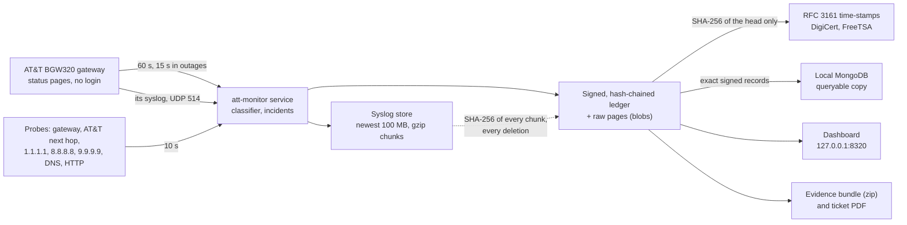

# AT&T BGW320 Evidence Logger (`att-monitor`)

**Tamper-evident, time-stamped evidence of AT&T Fiber outages, so you can show AT&T that a problem
is on *their* side.**

`att-monitor` is a Windows service that watches an AT&T Fiber connection around the clock through the
AT&T **BGW320** gateway (tested with the BGW320-505) and through independent Internet probes. It
classifies every 10-second cycle with conservative, versioned rules and writes everything into an
append-only, hash-chained, Ed25519-signed ledger that public Time-Stamp Authorities time-stamp. A local
dashboard shows what is happening, including an **MRTG-style traffic chart and a live flow meter** built
from the gateway's own counters and the **gateway's own log messages (syslog)**. The ledger is mirrored
into a local **MongoDB** for queries, and one command turns the last 24 hours into a **PDF for an AT&T
service ticket**, backed by an evidence bundle that anyone can verify.

> Not affiliated with or endorsed by AT&T. "AT&T", "BGW320" and the gateway's page names belong to
> their owners. The monitor reads the gateway's own pages (its status pages need no login; with the
> Device Access Code it checks the outage-redirect and Syslog settings about once a day) and keeps two
> gateway settings as it needs them: the outage redirect off, and the Syslog page sending the gateway's
> log to this PC (see below).

---

## Contents

- [What it records](#what-it-records)
- [How it works](#how-it-works)
- [Requirements](#requirements)
- [Install](#install)
- [The gateway's outage "hijack" redirect](#the-gateways-outage-hijack-redirect)
- [Traffic: MRTG-style chart and flow meter (no SNMP needed)](#traffic-mrtg-style-chart-and-flow-meter-no-snmp-needed)
- [The gateway's syslog](#the-gateways-syslog)
- [Dashboard](#dashboard)
- [Data storage: ledger and MongoDB](#data-storage-ledger-and-mongodb)
- [Report for an AT&T service ticket](#report-for-an-att-service-ticket)
- [Giving evidence to AT&T](#giving-evidence-to-att)
- [Chain of custody](#chain-of-custody)
- [Commands](#commands)
- [Configuration](#configuration)
- [Privacy, security and network use](#privacy-security-and-network-use)
- [Development](#development)
- [Acknowledgements](#acknowledgements)

## What it records

* **AT&T's own gateway**: every minute (every 15 s during an outage) the BGW320's status pages, which
  need no login: broadband and WAN state, fiber/PON state (`O1 INIT` … `O5 OPERATION`), the optical
  receive and transmit power **with the gateway's own low-Rx ALARM/WARNING flags and thresholds**, the
  fiber "Last Change" counter, uptime (restarts), firmware, serial number and clock. The raw pages are
  stored byte for byte.
* **The path to the Internet**: every 10 s pings and TCP connects to the gateway, AT&T's next hop and
  three independent providers (Cloudflare, Google, Quad9); every minute DNS (gateway, AT&T and public
  resolvers) and HTTP checks; traceroutes during outages.
* **The home side**: Wi-Fi or Ethernet link state and signal, whether traffic actually leaves through
  the AT&T gateway (a VPN or second network is detected), heavy household traffic, PC sleep and resume,
  and the PC clock against NTP servers.
* **Traffic**: how much the household sends and receives through the gateway, from the gateway's own
  WAN byte and packet counters (read with every snapshot), and this PC's own traffic from its network
  adapter's counters, shown as an MRTG-style chart, daily totals and a live flow meter.
* **The gateway's own log (syslog)**: the monitor sets the gateway to send it to this PC and keeps it
  so; every message is received and kept (the newest 100 MB by default), and the ledger records the
  SHA-256 of every chunk of messages and every deletion.
* **A verdict per cycle**: `ONLINE`, `DEGRADED`, `ISP_OUTAGE` or `LOCAL_FAULT`, with a cause (for
  example `FIBER_LINK_DOWN`: the gateway itself reports its fiber link down) and an attribution
  (provider, local, undetermined). Rules are conservative: a gateway restart, a VPN, a Wi-Fi drop, PC
  sleep, heavy traffic or a single lost DNS packet is never blamed on AT&T. An incident opens when 3 of
  the last 6 cycles fail and its downtime is measured cycle by cycle.

## How it works



* Every record is a JSON line `{"h": SHA-256(b), "s": Ed25519(b), "b": "<record>"}`; each record names
  the hash of the one before it, so removing, reordering or editing any record breaks the chain. The
  signing key is created on first start and protected with Windows DPAPI (machine scope).
* Every 30 minutes and after each outage, the SHA-256 of the newest record is sent to two public
  Time-Stamp Authorities. Their signed RFC 3161 tokens prove that the ledger up to that record existed
  at that time.
* The ledger is the source of truth. The MongoDB copy, the dashboard, the exports and the PDF are all
  derived from it.
* The gateway's syslog messages are the one exception: the ledger can never delete anything, so they are
  kept in a separate store with a size limit, and the ledger holds their proof (the SHA-256 of every
  chunk of messages, and a record of every deletion). See [The gateway's syslog](#the-gateways-syslog).

## Requirements

* Windows 10 or 11 (the service runs as LocalSystem), on a PC connected to the AT&T gateway. A wired
  Ethernet connection makes the evidence stronger.
* An AT&T BGW320 gateway and its **Device Access Code** (printed on the gateway's label). The code is
  needed only for the gateway's settings - to keep the outage redirect off and the Syslog page sending
  the gateway's log to this PC; everything else uses pages that need no login.
* [Go](https://go.dev/dl/) 1.27 or newer to build (the build fetches the right toolchain if needed).
* Optional: [MongoDB Community Server](https://www.mongodb.com/try/download/community) running
  locally (the default `mongodb://127.0.0.1:27017`) for the queryable copy.
* Optional: Microsoft Edge or Google Chrome (to print the ticket PDF), and Python 3.9+ (to run the
  verifier shipped inside every evidence bundle).

## Install

### Quick install (no build tools needed)

1. On the PC that is connected to your AT&T gateway, download **`ATT-Monitor-Setup-<version>.exe`** from
   the [latest release](https://github.com/siujacky/ATT_BW320_evidence_logger/releases/latest).
2. Double-click it. The program is not code-signed, so Windows may say it protected your PC: choose
   **More info → Run anyway**. Then choose **Yes** when Windows asks for administrator permission.
3. Type the **Device Access Code** printed on the label of your AT&T gateway (not the Wi-Fi password).
   What you type is not shown.

Setup checks the code with the gateway (a read-only login), installs and starts the service, adds a
Windows Firewall rule that lets the gateway's syslog messages in (see [The gateway's
syslog](#the-gateways-syslog)), shows your **evidence key** and opens the dashboard. Within about 10
minutes the service sets the gateway's Syslog page to send the gateway's log to this PC. Write the key
down or email it to yourself: it identifies your evidence. If the code is mistyped, setup asks again; the
gateway allows one login attempt per minute, so it waits when needed, and after three rejections it
stops trying for an hour, so the gateway's login is never locked.

Running the same file again updates the program; press Enter at the code prompt to keep the stored
code. The dashboard is also in the Start menu ("AT&T Internet Monitor"). To uninstall, open Settings →
Apps → Installed apps → *AT&T Internet Monitor (evidence logger)* → Uninstall. Your evidence in
`C:\ProgramData\ATTMonitor` is kept.

### Build from source

1. Get the code and build it:

   ```powershell
   git clone https://github.com/siujacky/ATT_BW320_evidence_logger.git
   cd ATT_BW320_evidence_logger
   .\build.ps1              # secret scan, go vet, tests, bin\att-monitor.exe
   ```

2. Create `password.txt` next to `build.ps1` with the gateway's address and Device Access Code. The file
   is in `.gitignore`; the build refuses to continue if the code appears in any source file.

   ```text
   ip:192.168.1.254
   password:<the Device Access Code from the gateway label>
   ```

3. Install the service from an **elevated** PowerShell:

   ```powershell
   .\build.ps1 -Install
   # or: .\bin\att-monitor.exe install --access-code-file .\password.txt
   ```

   This copies the program to `C:\Program Files\ATT Monitor\`, stores the access code DPAPI-encrypted in
   `C:\ProgramData\ATTMonitor\keys\` (you may delete `password.txt` afterwards), adds the Windows
   Firewall rule for the gateway's syslog, creates and starts the `ATTMonitor` service and prints the
   **ledger key fingerprint**. Write the fingerprint down or email it to yourself: it identifies your
   evidence, and you give it to AT&T separately from any evidence.

   If you saved gateway pages before installing (setup-time evidence), pass the folder with
   `--bootstrap DIR`; it is imported into the ledger as the first record after genesis.

You can also double-click `bin\att-monitor.exe`, or run `att-monitor setup`, for the guided setup
described above.

**Upgrade:** build a newer version and run `install` (or `setup`) again, elevated. The service stops,
the program is replaced and the service restarts; the ledger continues. **Uninstall:** Settings → Apps,
or `att-monitor uninstall`. Either way the service, the program, its Start menu shortcut, its Settings
entry and its firewall rule are removed, and the evidence in `C:\ProgramData\ATTMonitor` is kept.

## The gateway's outage "hijack" redirect

When the fiber or WAN is down, the BGW320 by default **redirects web browsing to its own "broadband is
down" page** (Diagnostics → Event Notifications → *Broadband Status Notification*). That hijacks the
connection your probes and browser use exactly when you need to see what is happening. The service
switches the redirect **off**, checks it at startup and every day, records every check in the ledger,
and switches it off again if AT&T re-enables it (for example with a firmware update or a remote reset).

```powershell
att-monitor gateway notification status
att-monitor gateway notification on    # restore AT&T's default (also stops the automatic enforcement)
att-monitor gateway notification off   # switch the redirect off again (and resume enforcement)
```

The monitor also records what the gateway's DNS answers during an outage: answers for every name that
point at the gateway itself are recorded as a DNS hijack. AT&T's account-level "DNS Error Assist"
(redirects for non-existent domains) is a separate setting at att.com → Profile → Privacy settings.

## Traffic: MRTG-style chart and flow meter (no SNMP needed)

Traffic graphs such as MRTG's usually poll a router's interface counters over SNMP. **The BGW320 offers
no SNMP to the home network**: a read-only SNMP query to its UDP port 161 is answered "port
unreachable", and none of the gateway's 49 web pages has an SNMP setting (AT&T manages the gateway from
its own network, with TR-069). There is nothing to point at this PC, and no SNMP traps are ever sent.

The same numbers are on the gateway's *Broadband Status* page, which needs no login and which the
monitor reads anyway with every snapshot (every minute, every 15 s during an outage): the WAN's **IPv4
receive and transmit byte and packet counters**. From two consecutive readings the monitor computes the
rate in each direction. The byte counters are 32-bit and wrap around every 4 GiB: the packet counters
tell whether a wrap is certain, and when the counter may have wrapped more often than can be told, the
rate is shown as **"at least"**. Counters that were reset (a gateway restart) never show as traffic.

* **Traffic chart** (Overview, 1 hour to 7 days), drawn like an MRTG graph: download as a filled area,
  upload as a line, in bits per second with automatic units, short marks at the highest rate between two
  readings, the classifier's 80 Mb/s heavy-traffic line, "at least" markers, and gaps where there is no
  reading. Under it MRTG's legend (maximum, average and current for the WAN download, the WAN upload and
  this PC), a table view, and the volume per day.
* **Live flow meter** (Overview): the current download and upload through the gateway as numbers and
  bars, a sparkline of the last 15 minutes or so, and this PC's own rates. While the Overview is open and
  visible the dashboard asks every 5 seconds; the service reads the Broadband Status page for it at most
  once every 5 seconds whoever asks, and while nobody watches the gateway gets no extra request. The
  flow meter is a display only: nothing of it is recorded (the snapshots are the evidence), and it never
  holds up the evidence - it skips a reading while the service itself is reading the gateway, gives up
  a reading after 5 seconds, and waits while the gateway does not answer the service's polls.
* **This PC's traffic** comes from the 64-bit counters of its network adapter that reaches the gateway,
  so the household's traffic can be told from this PC's.

The same counters feed the classifier: a slowdown is attributed to AT&T only while they show less than
80 Mb/s in both directions, because heavy household traffic could explain it otherwise.

## The gateway's syslog

The BGW320 can send its own log messages to a syslog server on the home network (Diagnostics →
Syslog). The monitor is that server: it receives them on UDP port 514, only from the gateway's address
(`syslog.allow` adds other senders), keeps every message exactly as it arrived with the time this PC
received it, and shows them on the dashboard's **Syslog** page (with search and a severity filter) and
with `att-monitor syslog`. (SNMP is still not possible: the BGW320 offers none, see
[Traffic](#traffic-mrtg-style-chart-and-flow-meter-no-snmp-needed).)

### The monitor sets the gateway to send its log here, and keeps it so

Like the outage redirect, the monitor keeps the gateway's **Syslog** page as it needs it. In its daily
settings check (the first within 10 minutes after the service starts, and again within minutes after
this PC's address changes) it reads the page and records it; when the page shows anything else it sets
it to:

* **Syslog**: On;
* **Server IP Address**: this PC's IPv4 address on the gateway's network;
* **Server Port**: `514` (`syslog.port`);
* **Log Level**: the most detailed level the gateway offers - **Notice** on the BGW320-505 with firmware
  6.34.7, which offers Emergency, Alert, Critical, Error, Warning and Notice (no Informational, no
  Debug). A level named in `gateway.syslog_level` comes first, and a level already set while Syslog is
  on is kept.

It changes nothing else on the page, and does it the way a browser without JavaScript does: the page
enables its fields only once Syslog is On, so the monitor first switches Syslog on with the page's
*Update* button, then fills in the fields and saves. It then reads the page back: a change counts only
if the gateway shows it, and a page the monitor does not fully understand is never posted. Every reading
is recorded in the ledger with the page, and every change with the pages before and after (a
`gateway_event` and a `config_change`). A failed attempt is recorded too, shows as *The gateway's Syslog
page could not be set*, and is tried again at the next check. While the gateway is set to send here but
no message from it arrives for a day, the dashboard says so (at level Notice the gateway may log
little).

**Changing it.** The dashboard's **Syslog** page (and the Syslog card on the Overview) shows the setting
and whether the monitor keeps it: *Send the gateway's log to this PC* sets it now and keeps it so; *Stop
sending* switches Syslog off on the gateway and stops keeping it. Each asks first, saying what will
happen on the gateway, and shows the outcome; the choice is saved (`gateway.enforce_syslog`) and
recorded. The same from the command line:

```powershell
att-monitor gateway syslog          # the setting, whether it is kept, the receiver and the store
att-monitor gateway syslog on       # send the gateway's log to this PC, and keep it so
att-monitor gateway syslog off      # switch it off on the gateway, and stop keeping it
```

To have the monitor only read the page, without switching it off, set `gateway.enforce_syslog` to
`false` in `config.json` and restart the service. Uninstalling leaves the gateway's setting as it is:
stop the sending first (*Stop sending*, or `att-monitor gateway syslog off`) if the gateway should no
longer send its log to this PC.

**By hand.** When the monitor cannot set the page (no access code stored, or its attempt failed - the
dashboard and `att-monitor gateway syslog` then say how), set it on the gateway itself: open
https://192.168.1.254, go to **Diagnostics → Syslog** and sign in with the Device Access Code; set
**Syslog** to On (the page then enables its other fields), enter this PC's IPv4 address as **Server IP
Address** and `514` as **Server Port**, and save. `att-monitor gateway syslog` prints the address to
enter. The messages confirm it at once: within a minute the Syslog card counts them as received.

The gateway sends to an address, not to a computer: the monitor sets the page again after this PC's
address changes, and a fixed address for this PC (a DHCP reservation on the gateway) avoids the gap.
Several monitors on one home network would fight over the setting: let only one keep it
(`gateway.enforce_syslog` false on the others).

### Kept within a size limit, with every chunk on record

The ledger can never delete anything, so the messages are not written into it. They go to the **syslog
store** in `C:\ProgramData\ATTMonitor\syslog\`:

* Every 30 seconds the received messages are appended to the open chunk file, one JSON line per message
  (the exact datagram, its sender and the time it was received). A chunk is **sealed** (compressed with
  gzip) when it reaches 1 MiB, about 5 minutes after it was opened (at the next of those 30-second
  flushes), and when the service stops; a chunk that a crash, or a ledger that refused records, left
  open is sealed at the next start.
* For every sealed chunk the ledger gets a **`syslog_chunk`** record: the SHA-256, size and message count
  of its content, the receive times of its first and last message, and how many messages were dropped or
  rejected meanwhile.
* The store keeps the **newest 100 MB** (MiB) by default: once it holds more, the oldest sealed chunks
  are deleted first. Optionally it also deletes the chunks whose newest message is older than a number of
  days. The open chunk is never deleted.
* Every deletion is a **`syslog_prune`** record naming the deleted chunks, their SHA-256 and the limit
  that deleted them.

So the ledger shows which messages existed and when, and when and why they were deleted, and every kept
chunk can be checked against its record (also in exported evidence bundles).

**Changing the limit.** The dashboard and the command line save the change, record it in the ledger as
a `config_change` and apply it at once; the chunks that no longer fit are deleted and recorded:

* Dashboard → **Syslog** → *Stored messages* shows the space used and lets you choose how much to keep
  (MiB, and optionally days). It asks first when the change deletes messages now. Saving the limits
  already in force changes, records and deletes nothing, and the page says so.
* `att-monitor syslog retention` shows the space used and the limits;
  `att-monitor syslog retention --keep-mb 250 --keep-days 30` changes them (a limit left out stays as it
  is). It too asks first when the change deletes messages now; `--yes` answers in advance (for scripts).
  While the service is stopped the change is recorded directly and applied when the service starts.
* Or edit `syslog.keep_mb` / `syslog.keep_days` in `config.json` and restart the service.

**Receiver limits.** Messages are accepted only from the gateway's address (and `syslog.allow`), at most
2,000 a minute (`syslog.max_per_minute`), 8 KiB each, and at most 1 MB a minute as stored. What goes
beyond is counted as dropped, and datagrams from other senders as rejected; the counts are in the
`syslog_chunk` records. The limits also bound what a device forging the gateway's address could make
the ledger grow by: a few MB a day at most.

**Windows Firewall.** `install` (and `setup`) add the inbound rule *AT&T Internet Monitor syslog*: UDP,
the port of `syslog.listen` (514), only from the gateway's address and only for `att-monitor.exe`.
`uninstall` removes it, and so does `install` while `syslog.enabled` is false. Run `install` (or `setup`)
again after changing `gateway.host` or `syslog.listen`; a sender added to `syslog.allow` needs a rule of
its own.

**What it proves.** Syslog over UDP has no authentication and no delivery guarantee. The records show
what this PC received (the exact bytes, the sender's address as Windows reported it, and this PC's
receive time), not that the gateway sent nothing else. The messages are supporting evidence: verdicts
and incidents do not depend on them.

## Dashboard

**http://127.0.0.1:8320**, on the monitoring PC only.

* **Overview**: the current state in plain words with its cause and attribution and the reasons behind
  it; cards for the Internet, the gateway's WAN, the fiber optics (Rx/Tx power against the gateway's own
  thresholds), the local link, evidence integrity (including the MongoDB copy) and the gateway's
  syslog (with its Syslog setting and the buttons that change it); the live flow meter; latency, loss,
  availability, traffic (MRTG-style, with daily totals) and optical charts from 1 hour to 7 days;
  recent incidents.
* **Incidents**: every outage with its timeline and evidence (raw gateway pages, traceroutes, DNS
  results) and a one-click evidence export.
* **Gateway**: every value read from the gateway, the fiber module diagnostics and the redirect setting.
* **Syslog**: the receiver and the gateway's Syslog setting - whether the monitor keeps it sending here,
  with *Send the gateway's log to this PC* and *Stop sending*; the gateway's log messages with search
  and a severity filter, each linked to the ledger record of its chunk (a very long message is
  shortened in the list; *Exact datagram* under it shows all of it); the space the syslog store uses
  and how much of it to keep.
* **Evidence**: ledger head, key fingerprint, time-stamps, *Verify now*, exports and operator notes
  (for example "Called AT&T, ticket 12345").
* **Records**: the raw ledger, record by record.
* Banners warn about the gateway's optical alarm, a changed gateway certificate (authenticated actions
  pause until you confirm it, which you should do only after an AT&T update), a VPN or second network
  bypassing the gateway, low disk space, a wrong PC clock, a ledger that refuses records, a syslog
  receiver that cannot listen (another program on UDP 514), a syslog store that fails, a gateway Syslog
  page that could not be set, or no syslog message from the gateway for a day.

## Data storage: ledger and MongoDB

All data lives in `C:\ProgramData\ATTMonitor` (readable by users, writable by the service and
administrators):

| Path | Contents |
|---|---|
| `ledger\` | the signed, hash-chained ledger, one JSONL segment per day |
| `blobs\` | raw gateway pages, traceroute output and time-stamp tokens, gzip, named by SHA-256 |
| `keys\` | the ledger signing key and the gateway access code, DPAPI-encrypted (SYSTEM and Administrators only) |
| `syslog\` | the gateway's syslog messages in chunk files (the only evidence that is ever deleted: within `syslog.keep_mb`, each deletion recorded) |
| `exports\` | evidence bundles |
| `logs\` | service logs (never contain secrets) |
| `config.json` | settings |

### The MongoDB copy

When MongoDB runs on the PC, the service keeps a continuously synchronized copy of the evidence in the
database **`attmonitor`**. It is a convenient place to query and analyse the data; the signed ledger
stays the source of truth and the chain of custody.

| Collection | One document per | Fields |
|---|---|---|
| `records` | ledger record (`_id` = seq) | `seq`, `ts` (date), `type`, `run`, `prev`, the exact `h`, `s`, `b` strings, and `data` (the record's content as BSON, for queries) |
| `blobs` | raw file (`_id` = SHA-256) | `data` (the exact bytes), `size`, `first_seq` |
| `incidents` | incident (`_id` = incident id) | the latest state of the incident and the record it comes from |
| `syslog` | syslog message (`_id` = `<chunk>#<line>`) | `chunk`, `chunk_seq` (its `syslog_chunk` record), `line`, the exact `raw_line` (which holds the message's text), and `rx` (date), `src`, `severity`, `facility`, `host`, `app` for queries |
| `meta` | `replication` | how far the copy has got, and the ledger's fingerprint |

* Records are copied in order, each exactly once; a restart or a MongoDB outage only delays the copy
  (the dashboard shows how far behind it is), and evidence recording never waits for MongoDB.
* Because every record keeps its exact `h`, `s` and `b`, a record read from MongoDB can be checked on its
  own: `h` must be the SHA-256 of `b` and `s` a valid signature of `b` under the ledger key. If a record
  in MongoDB differs from the ledger, the service reports it and never overwrites it.
* The `syslog` collection follows the syslog store: the messages of every sealed chunk are copied once
  the chunk matches its `syslog_chunk` record, and deleted when a `syslog_prune` record deletes the
  chunk. Each message is stored uncompressed, tens of times the space it takes in the store's
  compressed chunks (far more for repetitive messages), so the collection has a limit of its own: its
  documents take at most `syslog.keep_mb` MB (100 by default, before MongoDB's own compression, plus
  the indexes). Beyond that it keeps the newest messages - the oldest chunks' documents are deleted
  from the copy, while the store still has those chunks - and `mongo verify` counts such chunks
  without reporting them.
* The local MongoDB server accepts writes from any local program, so the copy is not evidence by
  itself. Compare it with the ledger at any time:

  ```powershell
  att-monitor mongo verify     # every record: same h, s and b as the ledger, valid hash and signature;
                               # also reports missing, altered or forged documents and blobs, and
                               # syslog documents that do not reproduce their chunk's SHA-256
  att-monitor mongo status
  ```

Example queries in `mongosh`:

```javascript
use attmonitor
// incidents attributed to AT&T, newest first
db.incidents.find({ "incident.attribution": "provider" }).sort({ updated: -1 })
// gateway snapshots in which the gateway raised its low-Rx optical alarm
db.records.find({ type: "gateway_snapshot", "data.derived.alarms": "OPTICAL_RX_LOW_ALARM" },
                { ts: 1, "data.derived.rx_power_x10": 1 })
// cycles per verdict state over the last day
db.records.aggregate([
  { $match: { type: "sample", ts: { $gte: new Date(Date.now() - 864e5) } } },
  { $group: { _id: "$data.verdict.state", cycles: { $sum: 1 } } }])
// the gateway's syslog messages of severity "err" or more severe, newest first
db.syslog.find({ severity: { $lte: 3 } }, { rx: 1, app: 1, msg: 1 }).sort({ rx: -1 })
```

To use another server or database, or to switch the copy off, edit the `mongo` section of
`config.json` and restart the service. The URI must not contain a user name or password: the
configuration is recorded in the ledger and in evidence bundles.

## Report for an AT&T service ticket

```powershell
att-monitor ticket-report --hours 24 --out C:\Reports --name "Your Name" --account 123456789 --phone "555-0100"
```

This exports a verifiable evidence bundle for the last 24 hours, verifies it, and writes a PDF (and an
HTML copy) that AT&T can act on. Page 1 is a summary for AT&T: the gateway's optical readings and
alarms (including when an alarm cleared and step changes of the receive level across a loss of light),
fiber link changes and gateway restarts, outages attributed to AT&T, the health of the home network,
and a requested action. The following pages hold the details: gateway identity, an optical chart and
readings table, gateway events, incidents, monitoring coverage, and how to verify the evidence. Every
figure is computed from the signed records the bundle contains, and the PDF's SHA-256 is recorded in
the ledger. The PDF is printed with Edge or Chrome in headless mode.

## Giving evidence to AT&T

1. Note calls and ticket numbers as you go: `att-monitor note "AT&T ticket 123456 opened, tech scheduled"`.
2. Export a bundle: Dashboard → Evidence → *Create export*, or
   `att-monitor export --from 2026-10-01 --to 2026-10-31 --prepared-by "Your Name" --out .`
3. Send the zip and, separately (for example by email), your **ledger key fingerprint**. `REPORT.html`
   inside is the readable summary. The bundle also holds the gateway's syslog chunks of the period that
   the syslog store still keeps (`syslog/`). Anyone can check the bundle:
   * `python tools/verify_bundle.py <zip>` checks the ledger, signatures, record times, the RFC 3161
     time-stamps (with OpenSSL) and every syslog chunk against its `syslog_chunk` record, using only
     Python's standard library plus the optional `cryptography` package;
   * `att-monitor verify-bundle <zip> --expect-fingerprint <fp>` does the same and also re-computes the
     report from the records, so an edited figure fails.

   Chunks of the period that the retention limit had deleted are listed as such, not failed: their
   SHA-256 stays in their records.

Tips that make the evidence stronger: monitor over **wired Ethernet** if you can (it removes "it's your
Wi-Fi"), disable sleep on the monitoring PC (sleep shows up as gaps), and keep the service running
continuously, because healthy periods are evidence too.

## Chain of custody

* **Integrity**: SHA-256 hash chain plus an Ed25519 signature on every record; raw bytes stored
  content-addressed; crash-safe appends with recovery that quarantines, never silently repairs.
* **Time**: RFC 3161 tokens from two independent authorities; only tokens whose certificate chains
  verify count as proof of time. Record times are checked against those anchors and against NTP.
* **Identity**: the key fingerprint you hand out separately ties a bundle to your ledger.
* **Honesty**: what cannot be attributed is labelled *undetermined*; monitoring gaps, restarts and PC
  sleep are recorded as such, and the bundle's own report is re-derivable from its records.
* **Syslog**: the messages live outside the ledger, within a size limit, but the ledger states the
  SHA-256 of every chunk of them and records every deletion, so a kept chunk can be checked and a
  deleted one is accounted for.

[docs/CHAIN_OF_CUSTODY.md](docs/CHAIN_OF_CUSTODY.md) explains what the evidence proves and how to verify
it step by step; [docs/DESIGN.md](docs/DESIGN.md) is the full specification and
[docs/PACKAGES.md](docs/PACKAGES.md) the package contracts.

## Commands

```text
att-monitor setup                                 guided install (what a double-click runs): asks only for
                                                  the gateway's Device Access Code
att-monitor install [--data DIR] [--listen 127.0.0.1:8320] [--access-code-file PATH] [--bootstrap DIR]
att-monitor uninstall [--interactive] | start | stop | status
att-monitor run [--data DIR]                      run in the foreground (console mode)
att-monitor set-access-code (--file PATH | --stdin)
att-monitor gateway notification [status|on|off]
att-monitor gateway syslog [status|on|off] [--json]
                                                  the gateway's Syslog setting, the receiver and the store; on: send
                                                  the gateway's log to this PC and keep it so; off: stop it
att-monitor gateway trust-cert                    confirm a changed gateway certificate (after an AT&T update)
att-monitor syslog [--since 24h] [--grep TEXT] [--severity LEVEL] [--limit N] [--json]
                                                  the gateway's syslog messages, oldest first (through the service)
att-monitor syslog retention [--keep-mb N] [--keep-days D] [--yes]
                                                  how much syslog is kept: shows it, or changes it
att-monitor verify [--json]                       verify the whole ledger
att-monitor verify-bundle FILE.zip [--expect-fingerprint FP] [--json]
att-monitor export --from TIME --to TIME | --incident ID [--prepared-by NAME] [--notes TEXT] [--out DIR]
att-monitor note "text" [--author NAME]
att-monitor ticket-report [--hours 24] [--out DIR] [--name N] [--account A] [--address ADDR] [--phone P]
                          [--best-time T] [--notes TEXT] [--no-pdf]
att-monitor mongo status | verify [--json]        the MongoDB copy of the ledger
att-monitor anchor                                time-stamp the ledger head now
att-monitor version
```

TIME is `YYYY-MM-DD`, `YYYY-MM-DDTHH:MM` (local time) or RFC 3339; a date-only `--to` includes that day.
`syslog --since` takes a duration such as `30m`, `1h`, `24h` or `7d` (at most 31 days); `--severity`
keeps that level and the more severe ones (`0`-`7`, or `emerg`, `alert`, `crit`, `err`, `warning`,
`notice`, `info`, `debug`); `--limit` (200 unless given, at most 5000) keeps the newest, and one
answer of the service holds at most 16 MiB of messages (very long ones end it sooner: shorten `--since`
or filter to see older ones). Each run of messages is headed by its chunk and the ledger record that
states the chunk's SHA-256.

## Configuration

`C:\ProgramData\ATTMonitor\config.json` is created with defaults on first start; restart the service
after editing it. Main settings:

| Setting | Default | Meaning |
|---|---|---|
| `gateway.host` | `192.168.1.254` | the BGW320's address |
| `gateway.enforce_notification_off` | `true` | keep the outage redirect switched off |
| `gateway.enforce_syslog` | `true` | keep the gateway's Syslog page sending its log to this PC while the receiver is on (`syslog.enabled`); `false`: only read it |
| `gateway.syslog_level` | `""` | the Log Level to set, when the gateway offers it; empty (or not offered): the level already set while Syslog is on, else Informational if the gateway offers it, else the most detailed level but Debug (Notice on the BGW320-505) |
| `gateway.poll_interval` / `incident_poll_interval` | `1m` / `15s` | gateway snapshots |
| `probes.fast_interval` | `10s` | the measurement cycle |
| `incident.open_after_cycles` / `window_cycles` | `3` / `6` | an incident opens when 3 of 6 cycles fail |
| `anchoring.interval` / `tsa_urls` | `30m` / DigiCert, FreeTSA | RFC 3161 time-stamps |
| `web.listen` | `127.0.0.1:8320` | the dashboard (loopback addresses only) |
| `mongo.enabled` / `uri` / `database` | `true` / `mongodb://127.0.0.1:27017` / `attmonitor` | the MongoDB copy |
| `mongo.store_blobs` | `true` | also copy the raw files into MongoDB |
| `syslog.enabled` | `true` | receive and keep the gateway's syslog messages |
| `syslog.listen` / `port` | `:514` / `514` | the UDP address the receiver listens on / the port the gateway is to send to |
| `syslog.allow` | `[]` | further senders (IP addresses) accepted besides the gateway |
| `syslog.flush_interval` / `max_per_minute` | `30s` / `2000` | how often received messages are stored / the most kept per minute |
| `syslog.keep_mb` / `keep_days` | `100` / `0` | keep at most this many MiB of syslog (1 to 1,048,576) and, above 0, nothing older than this many days |

## Privacy, security and network use

* The dashboard listens on 127.0.0.1 only and rejects requests from other sites.
* The gateway access code is stored DPAPI-encrypted in a folder only SYSTEM and Administrators can read;
  it never appears in logs, the ledger or exports.
* Evidence bundles contain your gateway's serial number, your public IP address and your outage
  history: share them with AT&T, not publicly. The gateway's syslog may also name devices on your home
  network and remote addresses (from its firewall messages), and bundles include the syslog of their
  period.
* Syslog text is untrusted (anything on the network can send a datagram): it is accepted only from the
  gateway's address, within size and rate limits, stored JSON-escaped, and shown escaped on the
  dashboard and in the terminal. The service's answers (at most 16 MiB of messages each) and the
  dashboard's list (long messages shortened) stay bounded however the messages are made.
* Outbound traffic: pings and TCP connects to 1.1.1.1, 8.8.8.8, 9.9.9.9 and AT&T's next hop; DNS queries
  for www.google.com; HTTP checks to msftconnecttest.com and google.com; SNTP to time.windows.com,
  time.google.com and pool.ntp.org; and **only a SHA-256 digest** to the Time-Stamp Authorities.
  MongoDB is used on the local PC only. Inbound: UDP 514 from the gateway (its syslog). The monitor logs
  in to the gateway about once a day (and after this PC's address changes) to check, and if needed set,
  its outage-redirect and Syslog settings. While the dashboard's Overview is open, the flow meter reads
  the gateway's Broadband Status page at most every 5 seconds.

## Development

```text
cmd/att-monitor     CLI, Windows service, install/upgrade, ticket-report
internal/model      record and API types           internal/contracts  interfaces between packages
internal/config     settings, DPAPI secrets         internal/ledger     signed hash-chained ledger
internal/gateway    BGW320 client and parsers       internal/probe      ICMP/TCP/DNS/HTTP probes, Wi-Fi
internal/monitor    scheduler, classifier           internal/anchor     RFC 3161 time-stamps
internal/export     evidence bundles, verifier      internal/ticket     the AT&T ticket report (HTML/PDF)
internal/mongostore MongoDB copy and its verifier   internal/web        dashboard and JSON API
internal/syslogrx   syslog receiver (UDP)           internal/syslogstore syslog chunks within a size limit
internal/winsvc     service control, ACLs           internal/sysinfo    host and software identity
```

```powershell
go test ./...                                     # unit tests (no network, no gateway)
$env:ATTMON_MONGO = "1"; go test ./internal/mongostore/   # live tests against a local MongoDB (throwaway database)
.\scripts\e2e.ps1                                 # end-to-end run in a temporary data folder
```

Tests never log in to or change a real gateway; gateway fixtures in `testdata\gateway` are sanitized
captures.

## Acknowledgements

Earlier BGW320 projects that informed the gateway client:
[Yeraze/BWG320-monitor](https://github.com/Yeraze/BWG320-monitor) and
[TheSethRose/BGW320-CLI](https://github.com/TheSethRose/BGW320-CLI).
